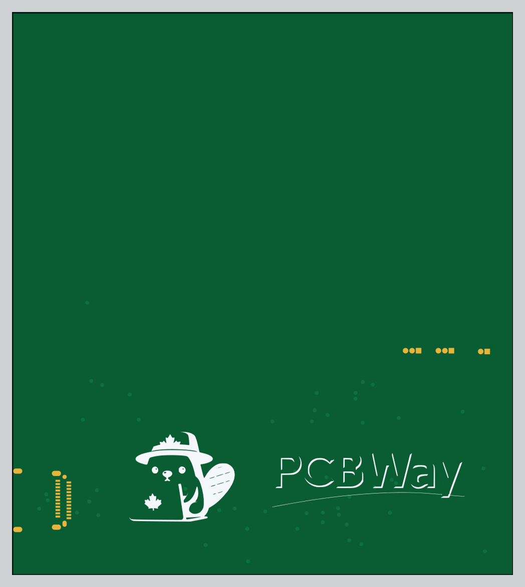
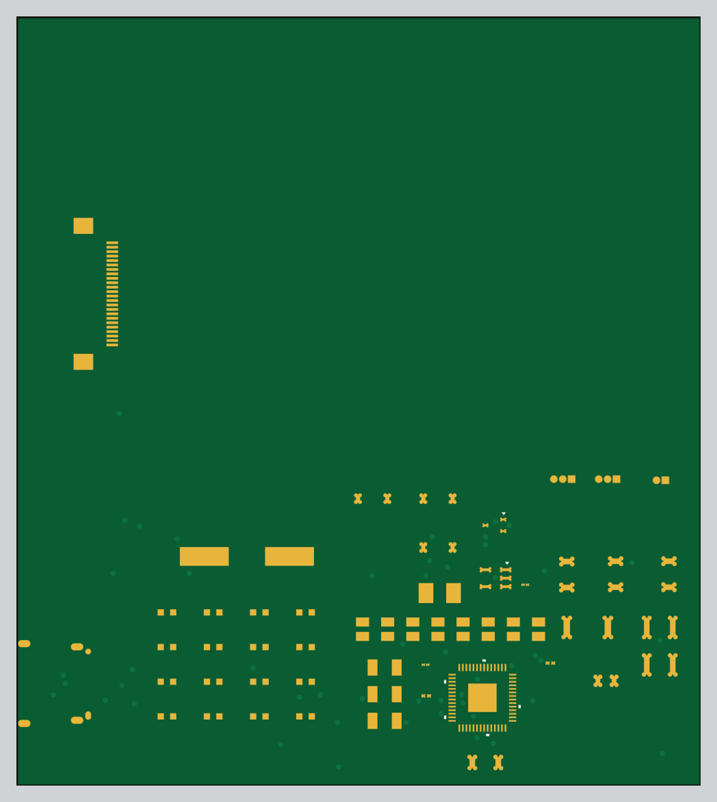
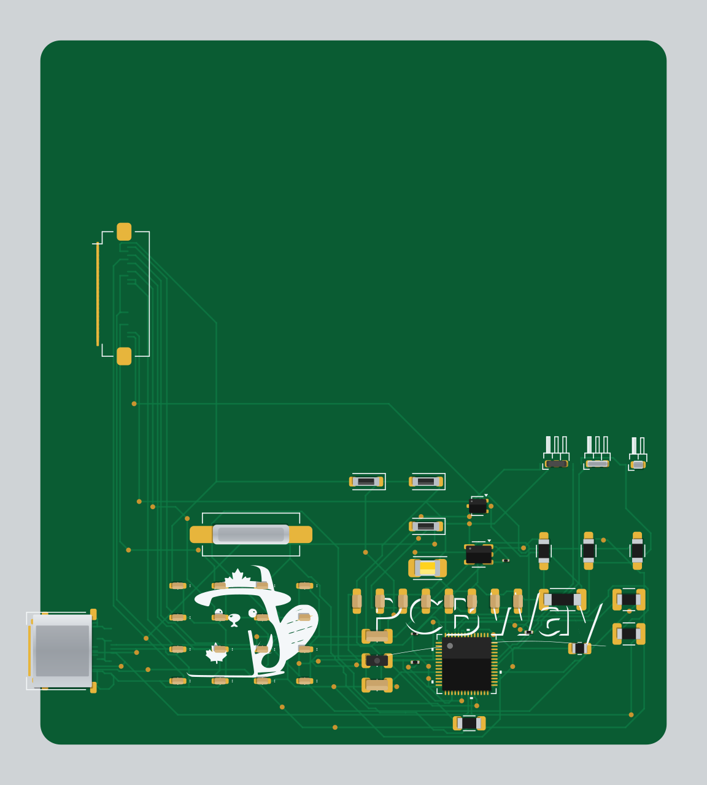
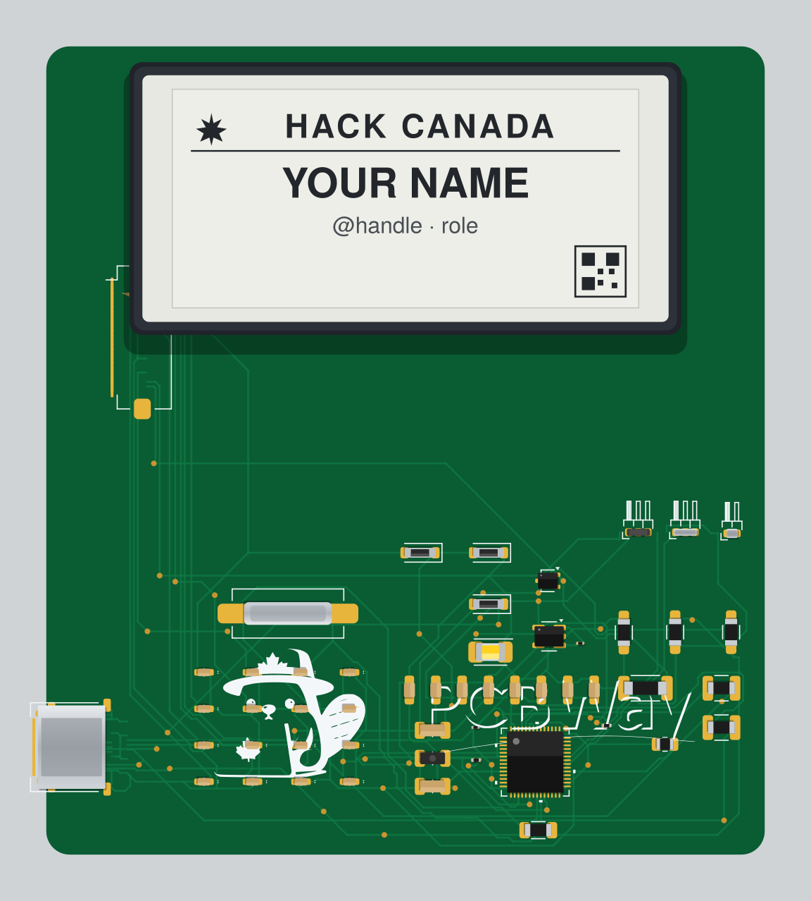

# Hack Canada Badge — v2 (RP2040 + E-Paper)

**The ambitious version.** A full smart conference badge built around an **RP2040** microcontroller with a **2.13" e-paper display**, USB-C, and onboard flash. This was the first serious attempt at the Hack Canada badge before the design was later simplified into the battery-free NFC badges of v3 and v4.



> Images are renders generated from this version's Gerber files (`pcb/prod/gerber/`). Colours are illustrative.

---

## What it is

Where the later revisions stripped everything down to a passive NFC tag, v2 aimed high: a programmable badge with a screen you could actually put graphics and text on. It's essentially a tiny RP2040 development board in badge form, with an e-paper panel, USB-C for power and programming, and external flash for firmware and assets.

The trade-off is cost and complexity — a screen, an MCU, a crystal, flash, USB-C, and all the supporting passives add up. That's what motivated the pivot to the "dirt cheap" NFC approach in v3/v4.

## How it works

```
USB-C ──► RP2040 ──► SPI ──► 2.13" e-paper display (GDEY0213F51)
            │
            ├──► QSPI ──► W25Q32 flash (firmware + images)
            ├──► 12 MHz crystal
            ├──► BOOT + RESET buttons, SWD header
            └──► status LED
```

Plug it in over USB-C, flash firmware to the RP2040 (BOOTSEL/UF2 or SWD), and drive the e-paper display to show a name, schedule, or artwork. The display holds its image with no power, which suits a badge that spends most of its life idle.

## Core components

| Function | Part |
| --- | --- |
| Microcontroller | RP2040 |
| Display | GDEY0213F51 — 2.13" e-paper / E-Ink (SEEKINK panel) |
| Flash | W25Q32JVSSIQ — 32 Mbit (4 MB) SPI/QSPI |
| Clock | 12 MHz crystal (FC4SDCBMF12.0-T1) |
| Power / data | USB Type-C |
| Indicator | VLMC3100-GS08 LED |
| Protection | LESD5D5.0CT1G TVS/ESD diodes |
| Controls | BOOT + RESET buttons, SWD debug header |

## Board

| Spec | Value |
| --- | --- |
| Dimensions | 77.05 × 86.55 mm |
| Layers | 2 |
| Thickness | 1.6 mm |
| Designed in | KiCad 8 |

| Front | Back |
| --- | --- |
|  |  |

### Assembled (parts placed)

All 51 components drawn at their real board positions — the RP2040 and LDO as black QFN/SOT packages, USB-C and the 12 MHz crystal in metal, the power LED, Schottky diodes, and the dense field of caps and resistors around the MCU:



### With the e-paper display mounted

The 2.13" GDEY0213F51 panel connects over the FPC ribbon connector (upper-left) and sits above the board across the open top area, with the RP2040 and power circuitry tucked below it. Here it's showing a sample conference-badge layout:



> The display panel is illustrated as it would sit when assembled; the on-screen layout is a placeholder mock-up, not artwork from the repo.

## Repository layout (v2 branch)

```
pcb/
├── badge.kicad_pcb / .kicad_sch / .kicad_pro   # main design
├── prod/gerber/                                # Gerbers, drills, gbrjob — ready to fab
├── badge-backups/                              # KiCad auto-backups
├── <component>/                                # per-part symbol/footprint/3D libraries
│   (RP2040, W25Q32, GDEY0213F51, crystal, LEDs, TVS, caps …)
└── assets/                                     # logos
GDEY0213F51.kicad_sym                           # e-paper display symbol
README.md
```

## Building your own

1. **Fabricate:** send `pcb/prod/gerber/` (or `badge-gerbers-and-designs.zip`) to your board house. It's a 2-layer, 1.6 mm board.
2. **Edit:** open `pcb/badge.kicad_pro` in KiCad 8 to modify the layout or schematic.
3. **Assemble & flash:** populate the parts, power over USB-C, and load RP2040 firmware via UF2 (BOOTSEL) or the SWD header. Then drive the GDEY0213F51 over SPI.

## History

v2 → **v3** (pivot to a battery-free NFC badge, adopted from the open "Opentaxus" design) → **v4** (streamlined 4-part NFC badge). See the `v3` and `v4` branches / READMEs.

## License

No license file is included, so all rights are reserved by default. Contact [@a3l6](https://github.com/a3l6) to discuss reuse.
